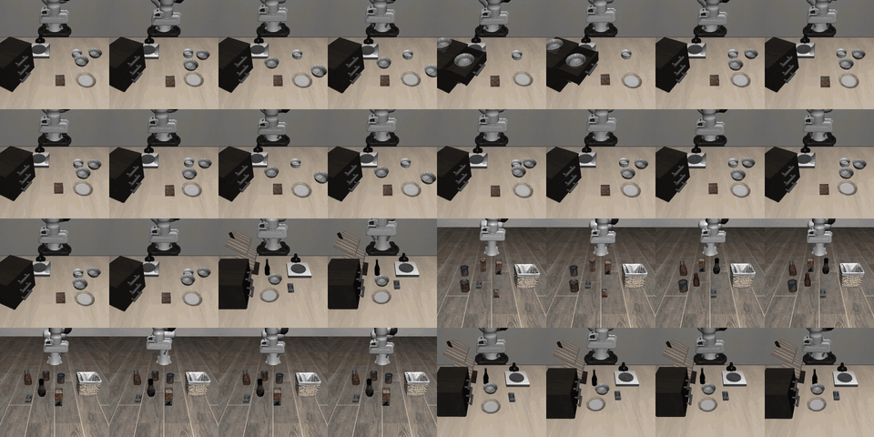

# LangGap: Diagnosing and Closing the Language Gap in Vision-Language-Action Models (IROS 2026)

[Paper](https://arxiv.org/abs/2603.00592) | [Dataset & Models](https://huggingface.co/YC11Hou)

<p align="center">
  <a href="https://2026.ieee-iros.org/"></a>
  <a href="https://arxiv.org/abs/2603.00592"></a>
  <a href="https://huggingface.co/YC11Hou"></a>
  <a href="https://yuchenhou.me/assets/video/langgap_video.mp4"></a>
  <a href="https://yuchenhou.me/projects/1_vla_benchmark/"></a>
</p>

<p align="center">
  <b>Yuchen Hou</b>, <b>Lin Zhao</b><br>
  Department of Electrical and Computer Engineering, National University of Singapore<br>
  <i>2026 IEEE/RSJ International Conference on Intelligent Robots and Systems (IROS 2026), Pittsburgh, PA, USA</i>
</p>

<table align="center" width="100%">
  <tr>
    <td colspan="2" align="center"><a href="https://yuchenhou.me/assets/video/langgap_video.mp4"></a> </td>
  </tr>
  <tr>
    <td align="center" width="47%"><em>▶ <b>3-minute overview video</b> (click to play, MP4)</em></td>
    <td align="center" width="53%"><em><b>Same table, different words.</b> 32 rollouts in the same scenes; only the instruction changes.</em></td>
  </tr>
</table>

## Overview

Vision-Language-Action (VLA) models achieve near-perfect success on standard robotic manipulation benchmarks like LIBERO — but do they actually understand language? **LangGap** reveals that VLAs largely ignore language instructions and instead memorize visual shortcuts. We provide a diagnostic benchmark and a data augmentation method that forces genuine language grounding.

**The Problem**: In LIBERO, each scene layout maps to exactly one task. VLAs can achieve high accuracy by simply memorizing which action sequence goes with which visual scene — without reading the instruction at all.

**Our Approach**: We design multiple different tasks within the same scene, so the visual input alone is ambiguous. The robot *must* understand the language instruction to select the correct action.

```
Same table layout (bowl, plate, cabinet, drawer):
  Task A: "Pick up the bowl from the cabinet and place it on the plate"
  Task B: "Pick up the bowl from the plate and place it in the drawer"
  Task C: "Pick up the bowl from the drawer and place it on the cabinet"

Vision is identical → language understanding is required.
```

**Key Results**: Baseline VLAs score near 0% on our extended tasks (confirming the language gap). Fine-tuning with our multi-task same-scene data significantly improves language grounding.

## LangGap at a Glance

<table align="center" width="100%">
  <tr>
    <td align="center" width="25%"><h2>93.8%</h2></td>
    <td align="center" width="25%"><h2>21.4%</h2></td>
    <td align="center" width="25%"><h2>0%</h2></td>
    <td align="center" width="25%"><h2>99</h2></td>
  </tr>
  <tr>
    <td align="center" valign="top">π0.5 success on the 40 original LIBERO tasks</td>
    <td align="center" valign="top">same scenes, semantically changed instructions</td>
    <td align="center" valign="top">on all 13 Change-Target tasks (260 episodes)</td>
    <td align="center" valign="top">tasks where language is the only signal</td>
  </tr>
</table>

### Key idea: same scene, different meaning

VLAs pass LIBERO through visual shortcuts: one task per layout, so memorizing the scene suffices. LangGap keeps the tabletop identical and varies only the instruction along four orthogonal semantic dimensions (**Change Object**, **Change Target**, **Spatial Description**, **Drawer Action**). A model that ignores language scores at most 1/k per scene with k tasks.

<table align="center" width="100%">
  <tr>
    <td colspan="2" align="center"> </td>
  </tr>
  <tr>
    <td align="center" width="43%"><em><b>Four perturbation dimensions.</b> Starting from "put the bowl on the plate" (95.5%), only the instruction changes.</em></td>
    <td align="center" width="57%"><em><b>Diagnosis.</b> π0.5 drops from 93.8% to 21.4% (−72.4 pts); Change Target collapses to exactly 0%.</em></td>
  </tr>
</table>

### Cross-model: everyone collapses

Success rate on the 59 extended tasks. Every tested VLA shows the same gap; our 45-task fine-tune is the only model with nonzero Change-Target success.

| Model | Original (40) | Extended (59) | Change Object | Change Target |
|-------|:-------------:|:-------------:|:-------------:|:-------------:|
| π0.5 | 93.8% | 21.4% | 29.3% | 0.0% |
| π0 | 48.3% | 8.6% | 10.8% | 0.0% |
| π0-FAST | 47.5% | 2.7% | 3.1% | 2.3% |
| SmolVLA | 38.0% | 6.4% | 7.6% | 0.0% |
| **π0.5 + LangGap (45-task)** | 89.5% | **22.8%** | 28.4% | **6.2%** |
| **π0.5 + LangGap (56-task)** | 85.5% | 20.4% | 27.5% | 5.0% |

### Can data close the gap? Partially.

LoRA fine-tuning of π0.5 at five progressive scales, evaluated on the extended tasks:

| Training config | Evaluated on | Baseline | Ours |
|-----------------|:------------:|:--------:|:----:|
| Single-task (1 ext) | 1 ext task | 3.75% | **90.0%** |
| 6-task (1 orig + 5 ext) | 5 ext tasks | 0.0% | **28.0%** |
| 45-task (40 orig + 5 ext) | 5 ext tasks | 0.0% | 4.0% |
| 16-task (16 ext) | 16 ext tasks | 26.2% | 6.2% |
| 56-task (40 orig + 16 ext) | 16 ext tasks | 26.2% | 27.5% |

- **Dilution**: adding the 40 easy visual tasks drops 28% → 4% on the same evaluation; easy tasks dilute the language-grounding signal.
- **Capacity wall**: 90% (1 task) → 28% (6) → 6.2% (16); diverse semantics is the fundamental challenge, and LangGap is the yardstick for measuring it.

### Evaluation scenes: the four LIBERO suites

<p align="center">
  
  <br>
  <em>Color key: <b>green</b> = original object/target · <b>blue</b> = alternative target · <b>orange</b> = alternative object · <b>purple</b> = interaction point. Percentages are π0.5 success rates when redirected to that element. libero_spatial: 28 extended tasks · libero_object: 22 · libero_goal: 9 · libero_10: original only.</em>
</p>

## Datasets & Models

### Main Experiment (56 tasks)

| Resource | HuggingFace Link | Description |
|----------|-----------------|-------------|
| langgap_full | [YC11Hou/langgap_full](https://huggingface.co/datasets/YC11Hou/langgap_full) | Full benchmark: 56 tasks (16 extended + 40 official LIBERO tasks) |
| langgap_ext | [YC11Hou/langgap_ext](https://huggingface.co/datasets/YC11Hou/langgap_ext) | Extended tasks only: 16 tasks (without official 40) |
| pi05-langgap-56task-216k | [YC11Hou/pi05-langgap-56task-216k](https://huggingface.co/YC11Hou/pi05-langgap-56task-216k) | π0.5 fine-tuned on langgap_full, 216k steps |

### Early Subset Experiment (45 tasks)

| Resource | HuggingFace Link | Description |
|----------|-----------------|-------------|
| langgap_45 | [YC11Hou/langgap_45](https://huggingface.co/datasets/YC11Hou/langgap_45) | 45 tasks (5 extended + 40 official LIBERO tasks) |
| langgap_6 | [YC11Hou/langgap_6](https://huggingface.co/datasets/YC11Hou/langgap_6) | 6 tasks (5 extended + 1 official) |
| pi05-langgap-45task-43k | [YC11Hou/pi05-langgap-45task-43k](https://huggingface.co/YC11Hou/pi05-langgap-45task-43k) | π0.5 fine-tuned on langgap_45, 43k steps |

See `TASK_MAPPING.md` for the full task mapping and `task_registry.py` for the 99-task registry.

## Repository Structure

```
.
├── collect/                    # Data collection scripts (scripted policies)
├── convert/                    # HDF5 → LeRobot format conversion
├── process/                    # Data verification and replay
├── train/                      # Training scripts (LoRA fine-tuning)
├── eval/                       # Evaluation on LIBERO (unified_eval.py)
├── scripts/                    # Batch evaluation monitoring
├── data/bddl_files/            # BDDL task definition files
├── tools/                      # Utility scripts
├── lerobot/                    # LeRobot + SmolVLA (dependency)
├── task_registry.py            # 99-task registry
└── TASK_MAPPING.md             # Task ID ↔ description mapping
```

## Setup

```bash
cd lerobot
pip install -e ".[smolvla]"
```

For evaluation, you also need:
```bash
conda activate lerobot
export MUJOCO_GL=egl
```

## Data Collection

### Scripted Policy Collection

```bash
# Single task
python collect/scripted_collect.py \
    --bddl <BDDL_FILE> --num 60 --output <OUTPUT>.hdf5

# Multi-task (specify task IDs)
python collect/scripted_collect_edge_grasp.py --task_id <40-47,49,50> --num_episodes 50

# Batch collection (16 tasks)
bash collect/collect_multi.sh
```

### Data Conversion

```bash
# HDF5 → LeRobot format
python convert/source_to_lerobot.py \
    --input /path/to/task_XX.hdf5 \
    --bddl /path/to/task.bddl \
    --repo_id <YOUR_HF_USERNAME>/<repo_name> \
    --push --private

# Multi-task batch conversion
bash convert/batch_convert_edge_grasp.sh

# Dataset merging
python convert/merge_datasets.py --output /path/to/merged
```

### Data Verification

```bash
# HDF5 verification
python process/verify_hdf5.py --hdf5 <FILE> --task_id <ID> --output_json <OUT>

# Replay verification
python process/replay_dataset.py \
    --dataset <REPO_ID> --bddl <BDDL> \
    --source_hdf5 <HDF5> --episodes 50 --output_dir replay_videos/

# Data comparison
python process/compare_datasets.py \
    --ours <REPO_ID> --reference <REF_REPO> --reference_tasks 0 --plots
```

## Training

```bash
bash train/finetune_lora.sh --model=<model> --dataset=<repo_id> [--task=<ids>] [options]
```

| Parameter | Default | Description |
|-----------|---------|-------------|
| `--model` | Required | Starting model path |
| `--dataset` | `langgap_full` | HuggingFace dataset repo ID |
| `--task` | All | Task IDs: `10`, `10,50`, `0-39`, `all` |
| `--lora_r` | 8 | LoRA rank |
| `--lr` | 2.5e-05 | Learning rate |
| `--batch_size` | 4 | Batch size |
| `--steps` | 200000 | Training steps |
| `--save_freq` | 1000 | Checkpoint save frequency |
| `--output_dir` | Auto | Checkpoint directory |

## Evaluation

```bash
python eval/unified_eval.py --model_path=<model> [options]
```

| Parameter | Default | Description |
|-----------|---------|-------------|
| `--model_path` | Required | Model or checkpoint path |
| `--task_id` | All | Task IDs: `3`, `3,4,5`, `3-7` |
| `--episodes` | 1 | Episodes per task |
| `--save_video` | False | Save evaluation videos |
| `--output_dir` | Auto | Output directory |

### Benchmark Evaluation (ext59)

Evaluate on all 59 extended tasks (including 43 held-out untrained tasks):

| Suite | Task ID Range | Task Count |
|-------|---------------|------------|
| Spatial | 40-53, 65-76 | 26 |
| Goal | 54-57, 77-81 | 9 |
| Object | 58-64, 82-98 | 24 |
| **Total** | **40-98** | **59** |

```bash
cd eval
conda activate lerobot
export MUJOCO_GL=egl

CUDA_VISIBLE_DEVICES=0 python unified_eval.py \
  --model_path <MODEL_PATH> \
  --task_id 0-98 \
  --episodes 10 \
  --output_dir eval_results/
```

## Citation

```bibtex
@article{hou2026langgap,
  title={LangGap: Diagnosing and Closing the Language Gap in Vision-Language-Action Models},
  author={Hou, Yuchen and Zhao, Lin},
  journal={arXiv preprint arXiv:2603.00592},
  year={2026}
}
```

## License

This project is for research purposes. See individual dependencies for their licenses.
